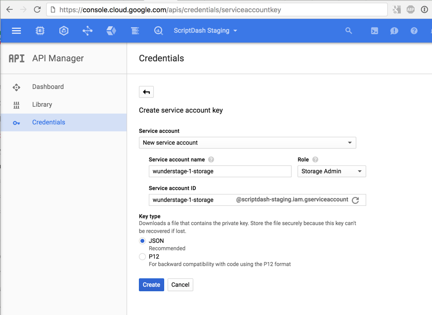

Wunderstage
===========

Cloud Native Continuous Integration

Installing wunderstage is comprised of the following stages:

* `stage0` - provision a Kubernetes cluster.
* `stage1` - builds necessary images.
* `stage2` - installs PaaS framework (Deis).
* `stage3` - installs Jenkins.

These commands are designed to be run withing a Google Cloud Shell for maximum simplicity but can be adapted for other Kubernetes environments.

## Stage 0 - provision cluster

* **Skip if**: you already have a Kubernetes cluster provisioned.
* **Prerequisites**: `gcloud` command set up: https://cloud.google.com/sdk/gcloud/

```sh
$ make stage0 
```

* **Verification**: `kubectl cluster-info` runs successfully and is pointed to your cluster.

## Stage 1 - generate images

* **Prerequisites**: Kubernetes cluster configured and `kubectl` configured correctly.
```sh
$ make stage1
```

## Stage 2 - install Deis

* **Prerequisites**: (GKE) a valid service account key

At this point we have Deis ready to install but there are some considerations. The default configuration uses ephemeral storage so at this point to may want to configure persistent storage.
See https://deis.com/docs/workflow/installing-workflow/configuring-object-storage/ for details.

**(GKE)** Steps:

1. Create a service account at https://console.cloud.google.com/apis/credentials/serviceaccountkey - give the service account the `Storage Admin` role. 
2. create `deis.values.yaml` using `deis.values.yaml.gke_example` as a guide.

Once you're done setting up `deis.values.yaml` (or making it blank to accept defaults):

```sh
$ make stage2
```
* **Note**: if you encounter the 'Error: could not find a ready tiller pod' error you just need to wait a little and retry.

## Stage 3 - install Jenkins

* **Prerequisites**: configure your default storage class in your k8s cluster if you haven't already.

**(GKE)** Steps:

```sh
$ kubectl create -f default-storage-class.yaml
```

```sh
$ make stage3
```

### Configuring Jenkins

At this point you should have your jenkins pod coming up.

Let's check the status:

First we'll define a handy alias that reduces typing:
```sh
$ alias kc='kubectl --namespace=ci'
```

Now let's check the status of the pod:
```sh
$ kc get po
```

You should see something similar to:
```
NAME                            READY     STATUS              RESTARTS   AGE
ci-1-jenkins-3866958816-tnm1a   0/3       ContainerCreating   0          9s
```

Wait a bit then run again:
```
ci-1-jenkins-3866958816-tnm1a   3/3       Running   0         2m
```

Great! we're up and running. Let's configure jenkins by finding the public ingress address:
```
kc describe svc ci-1-proxy |grep Ingress
```

Visit that URL in a web browser.

To obtain the admin password we need to check stdout of the jenkins container:

Let's set the pod name so we dont' have to re-type it:
```
$ POD=$(kc get po -o jsonpath='{.items[*].metadata.name}')
$ kc logs ${POD} jenkins
```

### Getting on production domain (optional)

The bootstrapping process creates a self-signed certificate. Let's replace that with a certificate that is issued by a trusted CA. 

Assuming you have the private key and certificate:

By default the SSL configuration is managed via a Kubernetes secret called `ci-1-proxy`.

The four secrets contained in this secret are:

* `cert.pem` - PEM encoded certificate
* `key.pem` - PEM encoded private key
* `dhparam` - custom dhparam
* `htpasswd` - htpasswd for basic auth

Example kubectl invocation to replace parts of this secret:

Assuming you have these four files in a directory you can update the existing secret like so:


```sh
$ ls
cert.pem dhparam  htpasswd key.pem
$ kubectl --namespace=ci create secret generic --dry-run -o yaml --from-file=. ci-1-proxy | kubectl --namespace=ci apply -f -
```

The kubernetes pod will not automatically pick up the new secret values but you can restart the nginx proxy container like so:
```sh
$ kc exec ${POD} -c proxy kill 1
```

#### Configure Github integration

To have activity on github automatically trigger builds we need to configure the github integration.

Prerequisites:
1. Create a GitHub user that has read access to relevant repositories.
2. Create a personal access token with the following scopes: **admin:repo_hook, repo, repo:status**.
3. (optional) Create an oAuth application to use GitHub for authentication.

There are some alternatives here but for simplicity we'll employ Automatic Mode in which Jenkins manages hooks for us.

See https://wiki.jenkins-ci.org/display/JENKINS/GitHub+Plugin for details.

Steps:
1. Walk through setup wizard and create an admin user.
2. Enable proxy compatiblity under `Manage Jenkins` -> `Configure Global Security`. (note: if you get invalid crumb errors disable CSRF, save, then re-enable with proxy support).
3. `Manage Jenkins` -> `Configure System` -> `GitHub` -> `GitHub Servers` -> `Add GitHub Server`.
4. `Credentials` -> `Add` -> `Jenkins` -> `Secret Text` -> enter your access token.
5. Set and test the credentials.
6. Under `Advanced` set the hook url to contain the basic authentication credentials.
7. note: if this hook isn't set up correctly you can set it in your GitHub org's main webhook settings.

(optional) To set up GitHub oAuth for authentication:
1. `Manage Jenkins` -> `Configure Global Security` -> `Access Control` -> `Security Realm` - set to Github Authentication Plugin.
2. Enter oAuth client id and secret key.

Now let's set up our project:
1. Navigate to Jenkins home.
2. `create new jobs` -> `GitHub Organization`. Choose a name.
3. Add credentials for scanning using the personal access token as the password.
4. Set 'Owner' to the GitHub organization name.
5. Supply any repo or branch name inclusions/exclusions.

#### Jenkinsfile

We now are ready to start preparing builds. In one of the repositories in your project create a Jenkinsfile:

```Jenkinsfile
node {
	stage 'Initialize'
		env.HOME = "${env.JENKINS_HOME}"
		// deis and kubernetes have some restrictions on names, so we massage JOB_NAME a bit
		// app name must be a rfc1035/rfc1123 label (DNS_LABEL): An alphanumeric (a-z, and 0-9) string, with a maximum length of 24 characters, with the '-' character allowed anywhere except the first or last character. Currently limited to 24 characters: https://github.com/deis/workflow/issues/212
		env.STAGING_NAME = "${env.JOB_NAME.replaceFirst(/.+?\//, '').toLowerCase().replaceAll(/[^a-z0-9]/, '-').take(24).replaceFirst(/-$/, '')}"

	stage 'Initialize Staging'
		sh "rm -f .deisinfo"
		sh "deis info -a ${env.STAGING_NAME} > .deisinfo || echo"
		def appinfo = readFile('.deisinfo')
		if (appinfo.contains('created:')) {
			echo "already initialized deis"
			sh "deis git:remote -a ${env.STAGING_NAME} -r ${env.STAGING_NAME} || echo"
		} else {
			sh "deis create ${env.STAGING_NAME} -r ${env.STAGING_NAME} || echo"
		}

	stage 'Stage'
		sshagent(['deis-key']) {
			wrap([$class: 'AnsiColorBuildWrapper', colorMapName: 'gnome-terminal']) {
				retry(3) {
					sh "git push -f ${env.STAGING_NAME} HEAD:refs/heads/${env.BRANCH_NAME}"
				}
			}
		}

	stage 'Seed DB'
	wrap([$class: 'AnsiColorBuildWrapper', colorMapName: 'gnome-terminal']) {
		retry(3) {
			sh "bash -x script/staging-init.sh"
		}
	}

	stage 'Staging Info'
	sh "deis logs -a ${env.STAGING_NAME}"
	sh "deis info -a ${env.STAGING_NAME}"
	echo "completed."
}
```

**note:** You may notice a failure that has to do with unapproved methods, if so carefully approve said methods via `Manage Jenkins` -> `In-process Script Approval`.

#### Enabling deis in Jenkins jobs

To enable running deis commands in Jenkins jobs we need to provide the jenkins deis user private ssh key as a Jenkins credential.

The contents of this file are placed in $PWD/secrets/id_rsa-deis.

Create a Jenkins ssh credential with the ID  of 'deis-key' and select 'From a file on Jenkins master' with the path `/etc/secrets/jenkins-ssh-key`

## Production Considerations

At minimum you should change REGISTRATION mode on deis-controller.

See https://deis.com/docs/workflow/managing-workflow/production-deployments

Let's set up a helper alias
```sh
$ alias kd='kubectl --namespace=deis'
```

Platform SSL:
```sh
$ kd create --namespace=deis secret generic deis-router-platform-cert --from-file=tls.key --from-file=tls.crt
```

Forcing ssl:
```sh
$ kd annotate deployment deis-router router.deis.io/nginx.ssl.enforce=true
```


## Troubleshooting

`FATAL: [ssh-agent] Could not find specified credentials` - make sure you've created the 'deis-key' ssh credential in Jenkins.
